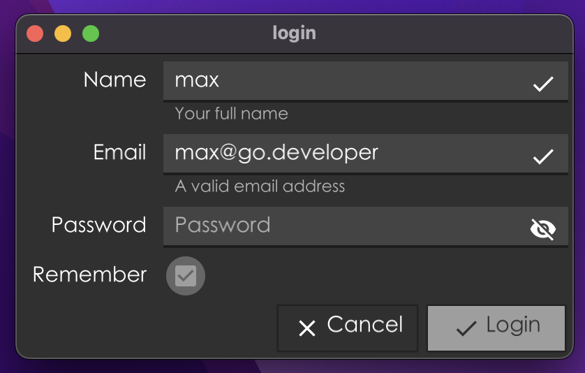
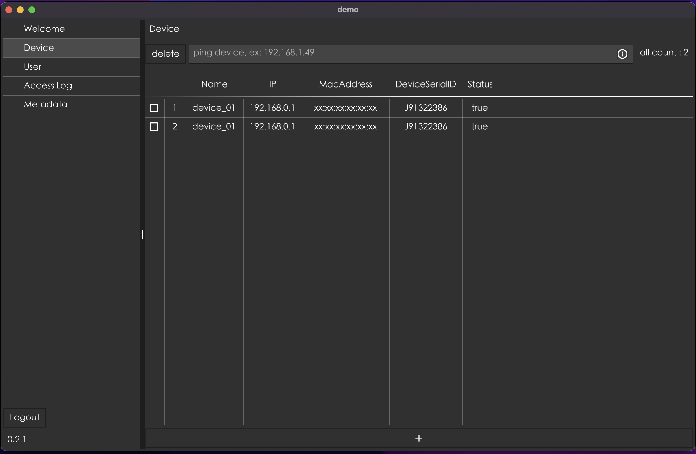
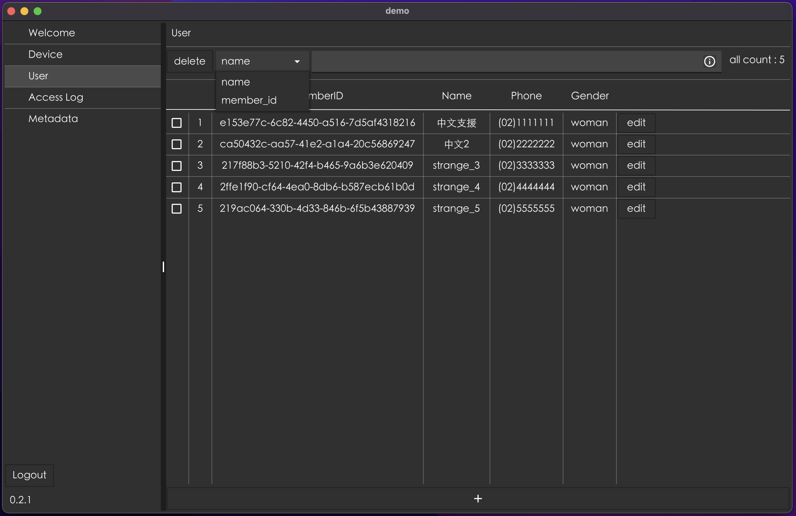
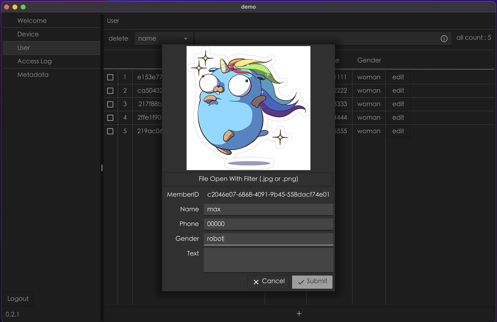
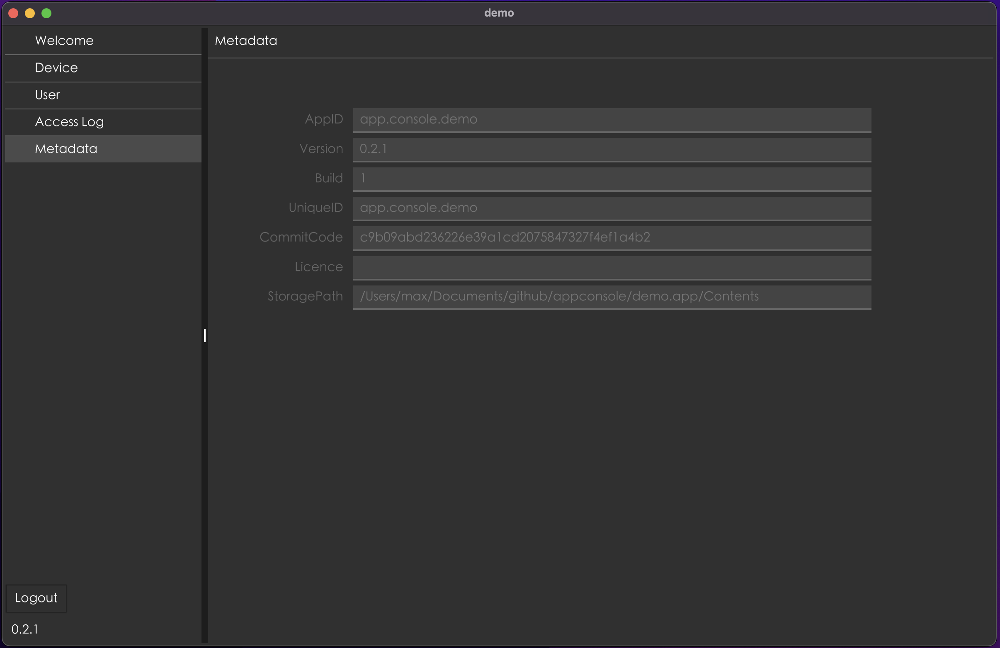

# build binary requirement
- golang
- fyne version v2.2.3

# features
- deploy / release 
    - github action, support, Windows/ Linux with checksu, ref github release
    - osx use makefile to release
- search by key
- multi delete
- add/edit item
- log rotation
- system tray
- app menu
- login/logout
- chinese font
- database
- custom table view / loading view / mask view
- enviroment variables load
- desktop notification

## deploy
- github action support windows/linux
- osx build release: `make darwin`

## release by fyne package (locally)
> https://developer.fyne.io/started/packaging

- `fyne package -os darwin --name demo`
- `fyne package -os linux --name demo`
- `fyne package -os windows --name demo`

# screenshot

## login

## device 

## user 

## edit user 

## metadata 

## log
